# Clean Architecture TypeScript

A comprehensive demonstration of Clean Architecture principles in TypeScript. This project is designed as an **educational resource** to clearly show the benefits of proper architectural separation.

## Table of Contents

- [What is Clean Architecture?](#what-is-clean-architecture)
- [The Problem It Solves](#the-problem-it-solves)
- [How It Works](#how-it-works)
- [Benefits Demonstrated](#benefits-demonstrated)
- [Project Structure](#project-structure)
- [Getting Started](#getting-started)
- [API Reference](#api-reference)
- [Testing](#testing)
- [Configuration](#configuration)

---

## What is Clean Architecture?

Clean Architecture organizes code into **concentric layers** where dependencies only point **inward**. The inner layers contain business logic and have no knowledge of the outer layers (databases, frameworks, UI).

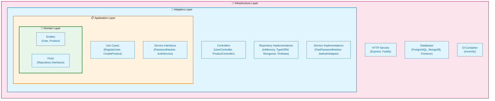

### The Golden Rule

> **Dependencies can only point INWARD. Inner layers know nothing about outer layers.**

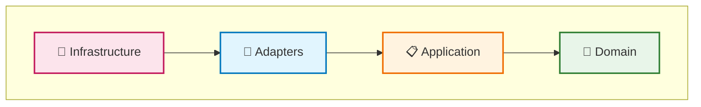

---

## The Problem It Solves

### ❌ Traditional Architecture (Tightly Coupled)

In a traditional approach, your business logic is **mixed** with infrastructure concerns:

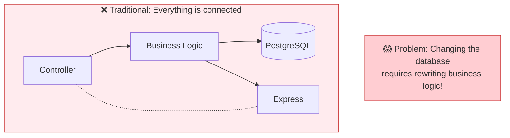

### ✅ Clean Architecture (Loosely Coupled)

With Clean Architecture, business logic depends on **abstractions** (interfaces), not implementations:

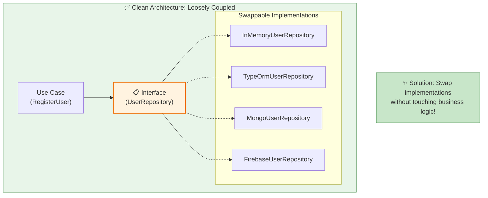

---

## How It Works

### Step 1: Define the Domain (Core Business)

The **Domain Layer** defines your business entities and the interfaces they need:

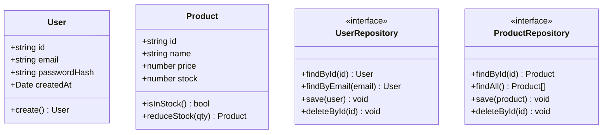

**Key insight**: The repository interfaces (ports) are in the Domain layer. They define **WHAT** operations are needed, not **HOW** they're implemented.

### Step 2: Create Use Cases (Application Logic)

Use cases orchestrate the business operations. They depend **only** on interfaces:

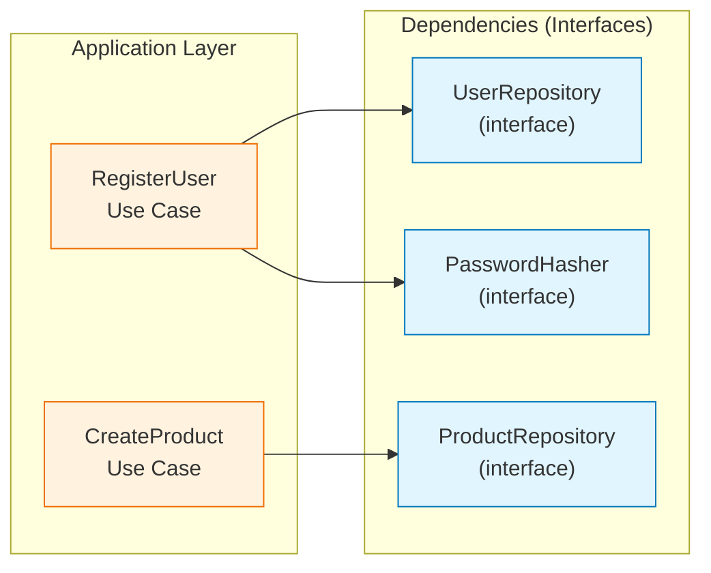

```typescript
// Use case depends on INTERFACE, not implementation
export class RegisterUser {
  constructor(
    private readonly userRepository: UserRepository,  // Interface!
    private readonly passwordHasher: PasswordHasher,  // Interface!
  ) {}

  async execute(input: RegisterUserDTO): Promise<Result<{ userId: string }>> {
    // Business logic here - no database/framework knowledge
  }
}
```

### Step 3: Implement Adapters

The **Adapters Layer** provides concrete implementations of the interfaces:

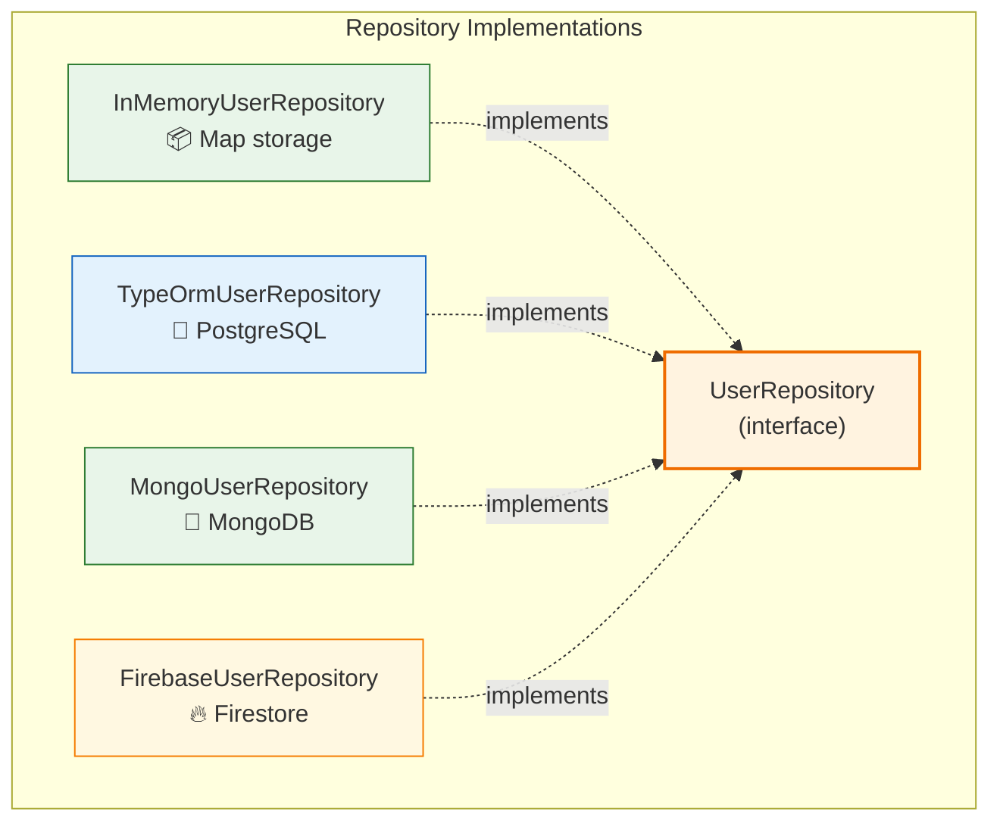

### Step 4: Wire Everything (Dependency Injection)

The **Infrastructure Layer** wires everything together based on configuration:

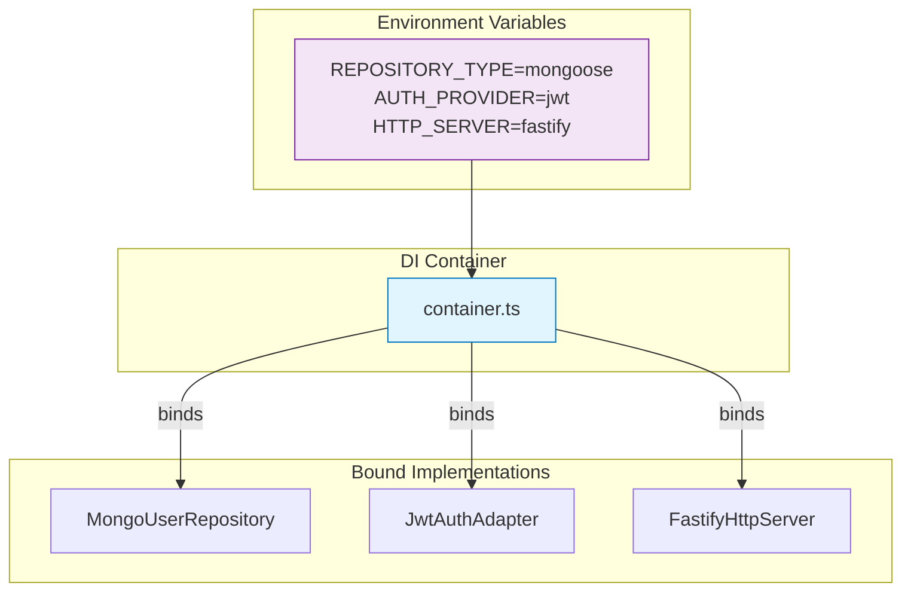

---

## Benefits Demonstrated

### 1️⃣ Infrastructure Swappability

Change your database with **one environment variable**:

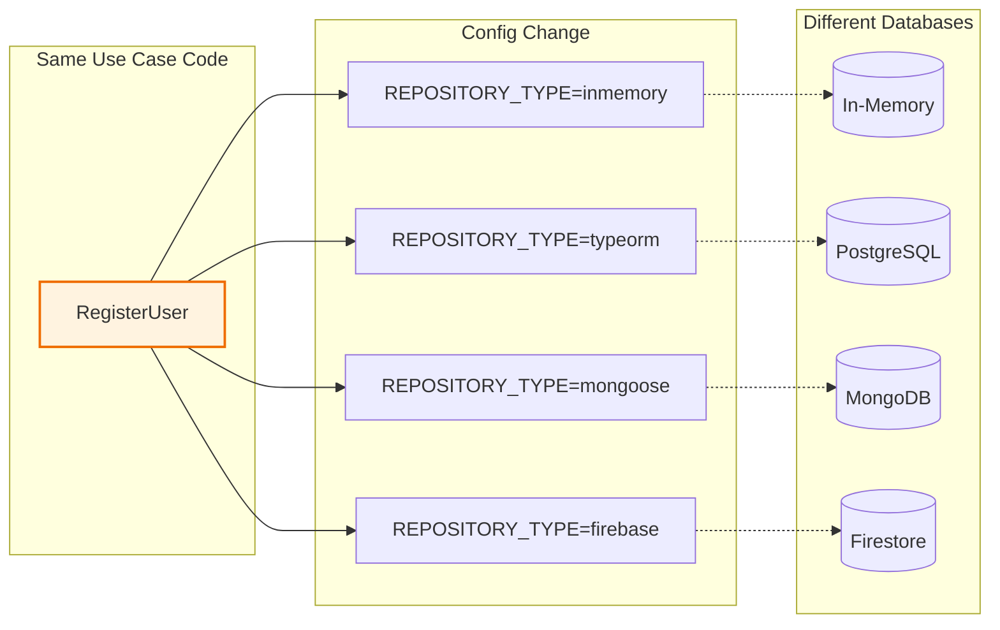

### 2️⃣ Testability

Test business logic **without any database**:

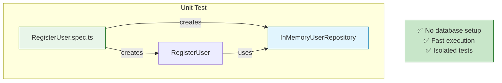

```typescript
// Test WITHOUT a real database
const repo = new InMemoryUserRepository();
const hasher = new FastPasswordHasher();
const usecase = new RegisterUser(repo, hasher);

const result = await usecase.execute({
  email: 'test@example.com',
  password: 'password123',
});

expect(result.ok).toBe(true);
```

### 3️⃣ Separation of Concerns

Each layer has a **single responsibility**:

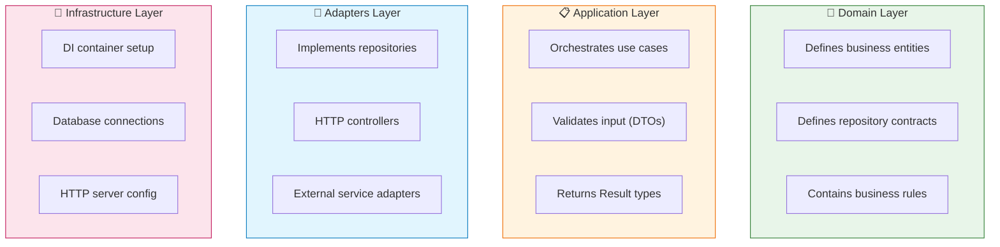

---

## Project Structure

```
src/
├── domain/                          # 💎 Enterprise Business Rules
│   ├── entities/
│   │   ├── User.ts                  # User entity with factory pattern
│   │   └── Product.ts               # Product entity with business rules
│   └── repositories/
│       ├── UserRepository.ts        # User repository interface (port)
│       └── ProductRepository.ts     # Product repository interface (port)
│
├── application/                     # 📋 Application Business Rules
│   ├── use-cases/
│   │   ├── RegisterUser.ts          # User registration
│   │   ├── GetUserById.ts           # Get user by ID
│   │   ├── GetUserByEmail.ts        # Get user by email
│   │   ├── DeleteUser.ts            # Delete user
│   │   ├── LoginUser.ts             # Authentication
│   │   ├── LogoutUser.ts            # Token revocation
│   │   ├── CreateProduct.ts         # Create product
│   │   ├── GetProductById.ts        # Get product by ID
│   │   ├── ListProducts.ts          # List all products
│   │   └── DeleteProduct.ts         # Delete product
│   └── services/
│       ├── PasswordHasher.ts        # Password hashing interface
│       └── AuthenticationService.ts # Auth service interface
│
├── adapters/                        # 🔌 Interface Adapters
│   ├── repositories/
│   │   ├── InMemoryUserRepository.ts    # In-memory (testing)
│   │   ├── TypeOrmUserRepository.ts     # PostgreSQL
│   │   ├── MongoUserRepository.ts       # MongoDB
│   │   ├── FirebaseUserRepository.ts    # Firestore
│   │   └── InMemoryProductRepository.ts # In-memory products
│   ├── services/
│   │   ├── FastPasswordHasher.ts        # SHA256 hasher
│   │   ├── InMemoryAuthAdapter.ts       # In-memory auth
│   │   ├── FirebaseAuthAdapter.ts       # Firebase Auth
│   │   └── JwtAuthAdapter.ts            # JWT-based auth
│   └── http/controllers/
│       ├── UserController.ts            # User endpoints
│       ├── AuthController.ts            # Auth endpoints
│       └── ProductController.ts         # Product endpoints
│
├── infrastructure/                  # 🔧 Frameworks & Drivers
│   ├── http/
│   │   ├── ExpressHttpServer.ts     # Express implementation
│   │   └── FastifyHttpServer.ts     # Fastify implementation
│   ├── database/
│   │   ├── typeorm/                 # PostgreSQL setup
│   │   ├── mongoose/                # MongoDB setup
│   │   └── firestore/               # Firebase setup
│   └── di/
│       ├── container.ts             # DI container wiring
│       └── types.ts                 # Injection tokens
│
├── presentation/http/               # HTTP Abstractions
│   ├── server.ts                    # Application entry point
│   ├── HttpServer.ts                # HTTP server interface
│   └── HttpTypes.ts                 # Request/Response types
│
└── shared/
    └── Result.ts                    # Functional error handling
```

---

## Getting Started

### Prerequisites

- Node.js >= 20.10.0
- Docker & Docker Compose (optional)

### Quick Start (No Database Required)

```bash
# Install dependencies
npm install

# Copy environment file
cp .env.example .env

# Start development server (uses in-memory storage)
npm run dev
```

The API will be available at `http://localhost:3000`

### With Docker

```bash
# Start all services
docker-compose up -d

# View logs
docker-compose logs -f app
```

---

## API Reference

### User Management

| Method | Endpoint | Description |
|--------|----------|-------------|
| `POST` | `/register` | Register a new user |
| `GET` | `/users/:id` | Get user by UUID |
| `GET` | `/users?email=...` | Get user by email |
| `DELETE` | `/users/:id` | Delete user |

### Authentication

| Method | Endpoint | Description |
|--------|----------|-------------|
| `POST` | `/auth/login` | Login and get token |
| `POST` | `/auth/logout` | Logout (revoke token) |
| `GET` | `/auth/me` | Get current user |

### Product Management

| Method | Endpoint | Description |
|--------|----------|-------------|
| `POST` | `/products` | Create a product |
| `GET` | `/products` | List all products |
| `GET` | `/products/:id` | Get product by UUID |
| `DELETE` | `/products/:id` | Delete product |

### Health Check

| Method | Endpoint | Description |
|--------|----------|-------------|
| `GET` | `/health` | Check API and database status |

### API Documentation

- **OpenAPI/Swagger**: See `openapi.yaml`
- **Postman Collection**: Import `Clean-Architecture-API.postman_collection.json`

---

## Testing

### Test Structure

```
test/
├── unit/
│   ├── domain/                 # Entity tests
│   │   ├── User.spec.ts
│   │   └── Product.spec.ts
│   ├── use-cases/              # Use case tests (all 10 use cases)
│   │   ├── RegisterUser.spec.ts
│   │   ├── CreateProduct.spec.ts
│   │   └── ...
│   └── adapters/               # Adapter tests
│       ├── InMemoryUserRepository.spec.ts
│       ├── InMemoryProductRepository.spec.ts
│       └── InMemoryAuthAdapter.spec.ts
└── integration/
    └── UserFlow.spec.ts        # End-to-end flow tests
```

### Running Tests

```bash
# Run all tests (watch mode)
npm test

# Run tests once
npm run test:run

# Run specific test
npx vitest run test/unit/use-cases/RegisterUser.spec.ts
```

### Test Results

```
✓ 93 tests passing
✓ 16 test files
✓ ~700ms execution time
```

---

## Configuration

### Environment Variables

| Variable | Default | Options |
|----------|---------|---------|
| `PORT` | `3000` | Any port number |
| `REPOSITORY_TYPE` | `inmemory` | `inmemory`, `typeorm`, `mongoose`, `firebase` |
| `AUTH_PROVIDER` | `inmemory` | `inmemory`, `firebase`, `jwt` |
| `HTTP_SERVER` | `express` | `express`, `fastify` |

### Switching Infrastructure

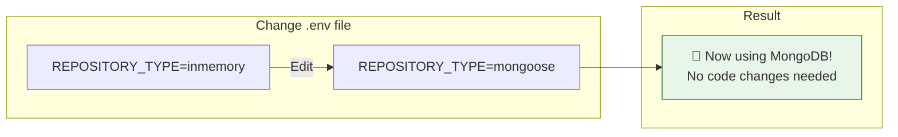

---

## Design Patterns Used

| Pattern | Usage |
|---------|-------|
| **Dependency Injection** | Inversify for IoC container |
| **Repository Pattern** | Abstract data access behind interfaces |
| **Factory Pattern** | Entity creation via `User.create()`, `Product.create()` |
| **Adapter Pattern** | Bridge use cases to infrastructure |
| **Result Type** | Functional error handling (no exceptions) |
| **DTO Pattern** | Input validation with Zod schemas |

---

## Technologies

| Category | Technologies |
|----------|--------------|
| **Runtime** | Node.js 20+, TypeScript 5.6 |
| **HTTP** | Express 4, Fastify 4 |
| **Databases** | PostgreSQL (TypeORM), MongoDB (Mongoose), Firebase Firestore |
| **Auth** | Firebase Auth, JWT |
| **DI** | Inversify |
| **Validation** | Zod |
| **Testing** | Vitest |

---

## References

- [Clean Architecture by Robert C. Martin](https://blog.cleancoder.com/uncle-bob/2012/08/13/the-clean-architecture.html)
- [The Clean Architecture (book)](https://www.amazon.com/Clean-Architecture-Craftsmans-Software-Structure/dp/0134494164)

---

## License

MIT
